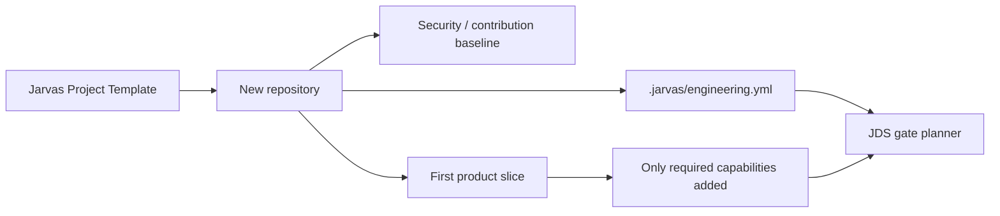
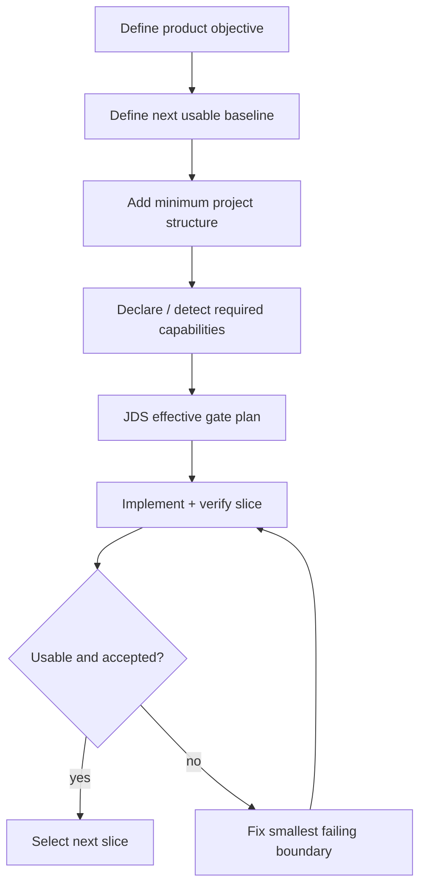
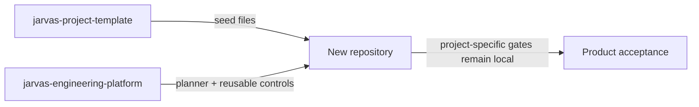

# Jarvas Project Template

[](docs/README.md)
[](.jarvas/engineering.yml)
[](docs/README.md)
[](SECURITY.md)

> A deliberately minimal GitHub Template Repository for starting a new Jarvas/Hermes project with **engineering governance before technology assumptions**.

## What this repository is

This is a **seed**, not an application. It provides the minimum repository structure needed to start work under the Jarvas Engineering Platform and JDS-001 without pre-selecting a language, framework, runtime, cloud, deployment model or agent topology.



## What is included

| Area | Included baseline |
|---|---|
| Engineering profile | `.jarvas/engineering.yml` with neutral `AUTO` project identity. |
| CI | JDS planning plus mandatory repository-security and delivery-evidence controls. |
| Contribution model | Pull request template and `CONTRIBUTING.md`. |
| Security | `SECURITY.md` and fail-safe repository defaults. |
| Documentation skeleton | `docs/`, ADR and architecture entry points. |
| Editor/repository hygiene | `.editorconfig` and `.gitignore`. |

## What is intentionally **not** included

The template does not assume or install:

- Python, Node.js, Go, Java or another language;
- Docker, Kubernetes or a cloud runtime;
- an application framework;
- an MCP server or agent runtime;
- databases, message queues or external services;
- deployment credentials or secrets;
- fixed lane/agent counts;
- product-specific acceptance criteria.

These are added only when the new repository's first usable vertical slice actually requires them.

## First delivery slice



Recommended sequence:

1. Replace the generic project title/description with the real product identity.
2. Define the product objective and first usable baseline.
3. Add only the minimum code/configuration for that slice.
4. Enable auto-detection and/or declare only the engineering capabilities actually required.
5. Let JDS select generic quality/security gates from capability, criticality and change impact.
6. Add project-specific acceptance next to the product when generic gates cannot prove the required behaviour.

## Why `metadata.name: AUTO` exists

GitHub Template Repositories do not substitute the new repository name into copied files. The template therefore uses `metadata.name: AUTO`; runtime/CI evidence uses GitHub's actual `${{ github.repository }}` identity rather than trusting a stale copied name.

## Relationship with the engineering platform



The template and the platform are separate by design:

- **this repository** defines the initial repository shape;
- **`jarvas-engineering-platform`** owns JDS-001, the capability catalogue, planner and reusable engineering controls;
- **the new project** owns its product semantics, runtime, risks and acceptance.

## Repository map

```text
.github/workflows/jds.yml       initial JDS orchestration
.github/pull_request_template.md
.jarvas/engineering.yml         neutral project engineering profile
CONTRIBUTING.md                 contribution baseline
SECURITY.md                     security/reporting baseline
docs/                           documentation skeleton
  adr/                          architecture decision records
  architecture/                 architecture views
```

## Documentation

- [Documentation guide](docs/README.md)
- [Architecture documentation guide](docs/architecture/README.md)
- [ADR guide](docs/adr/README.md)
- [Contributing](CONTRIBUTING.md)
- [Security](SECURITY.md)

## Template acceptance rule

A repository created from this template is **not production-ready merely because the template CI is green**. The template proves only the baseline repository controls. Product capability, live support, deployment safety and runtime acceptance must be established by the project that grows from it.
