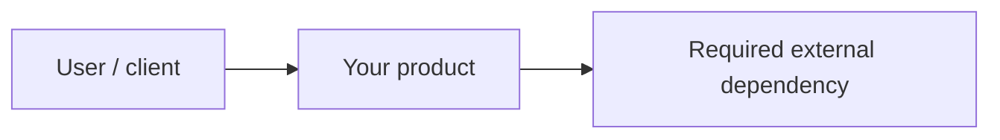
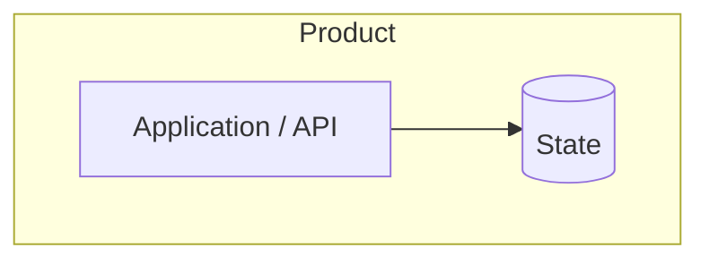
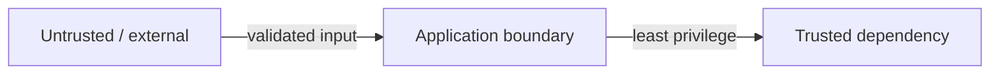
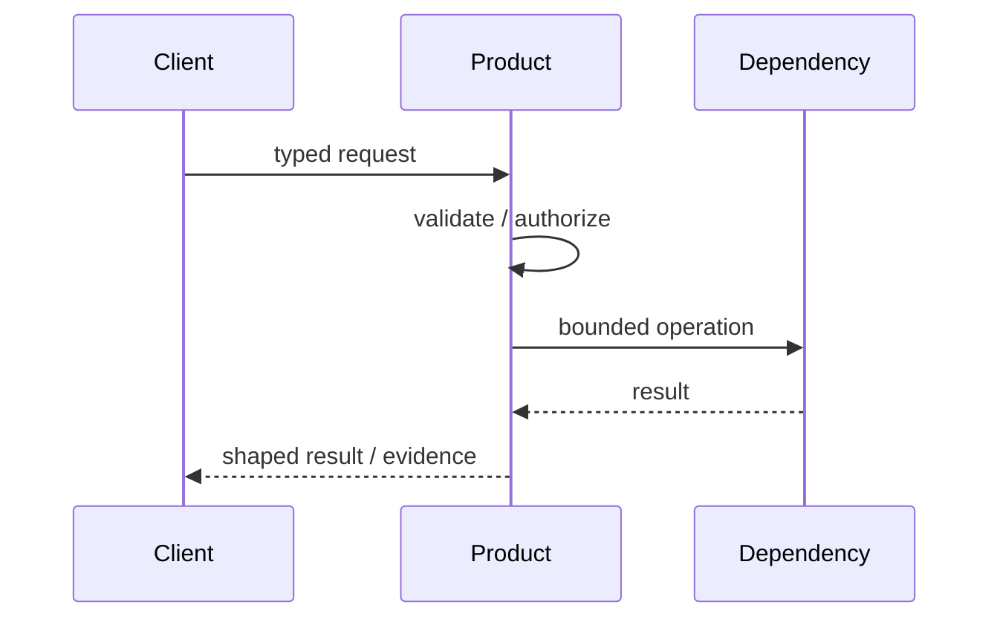

# Architecture documentation starter

Replace this guidance with the architecture of the product created from the template. Do not invent a target architecture before the first usable slice requires one.

## 1. System context

Describe actors, external systems and the product boundary.

## 2. Component / container view

Show only runtime components that actually exist or clearly mark future components as `PLANNED`.

## 3. Trust boundaries

Document where identity, credentials and untrusted data cross boundaries.

## 4. Important sequence

Use a sequence diagram for the product's most important operation or safety-sensitive mutation.

## 5. Current vs target

When architecture is evolving, keep two views:

- **Current** — backed by repository/runtime evidence.
- **Target** — planned design, explicitly labelled as such.

Never merge the two into a single diagram that makes planned components look deployed.

## 6. Decisions

Material architecture/security decisions should become ADRs under [`../adr/`](../adr/). The architecture view explains the system; the ADR explains why an important choice was made.
